## CDH 部署文档

### SSH 免密登陆
```
    ssh-keygen -t rsa                                   直接敲回车默认配置就可以
    cd /root/.ssh/
    cat id_rsa.pub >> authorized_keys                   将id_rsa.pub拷贝到authorized_keys文件中
    scp id_rsa.pub root@hadoop001:/root                 在hadoop002机子上运行
    cat /root/id_rsa.pub >> /root/.ssh/authorized_keys  在hadoop001机子上运行
    scp id_rsa.pub root@hadoop001:/root                 在hadoop003机子上运行
    cat /root/id_rsa.pub >> /root/.ssh/authorized_keys  在hadoop001机子上运行
    scp authorized_keys root@hadoop002:/root/.ssh/authorized_keys
    scp authorized_keys root@hadoop003:/root/.ssh/authorized_keys
```

### 关闭防火墙及清空规则(ALL)
1. `systemctl stop firewalld.service`
2. 验证防火墙是否关闭成功
    - `systemctl status firewalld.service`
    - 如下图所以则表示关闭成功
    - 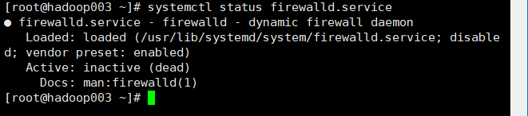
3. `systemctl disable firewalld`
4. `iptables -F`

### 修改HostName(ALL)
1. `vim /etc/hostname`

2. 重启三台服务器
3. 验证是否修改成功
    - 如图所示则表示修改成功
    - 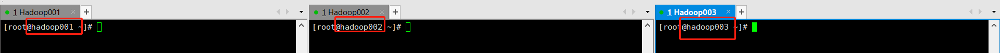
    
### 修改hosts文件(ALL)
1. `vim /etc/hosts`  
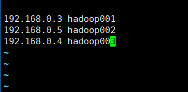
2. 验证hosts文件是否修改成功
    - 如图所有则便是修改成功
    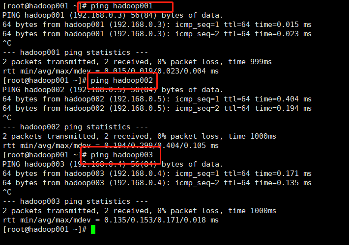
    - 注: 京东云需要开始所有内网端口
    
    
### 关闭所有节点的selinux(ALL)
1. `vim /etc/selinux/config`
    - 将SELINUX=enforcing改为SELINUX=disabled
    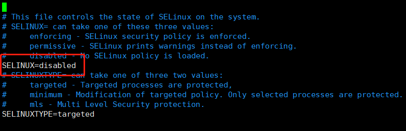
2. 重启服务器生效

### 设置所有节点的时区⼀致及时钟同步(ALL)
1. 所有节点安装ntp

    ` yum install -y ntp`
2. `vim /etc/ntp.conf` (仅Master)
```
#time
server 0.asia.pool.ntp.org
server 1.asia.pool.ntp.org
server 2.asia.pool.ntp.org
server 3.asia.pool.ntp.org
#当外部时间不可⽤时，可使⽤本地硬件时间
server 127.127.1.0 iburst local clock 
#允许哪些⽹段的机器来同步时间
restrict 172.19.7.0 mask 255.255.255.0 nomodify notrap
```
   - 参照上面模板进行修改, 一般也可以对允许网段不进行限制
   
   - 重启ntpd服务`systemctl restart ntpd`
   - 查看ntpd服务状态`systemctl status ntpd`
   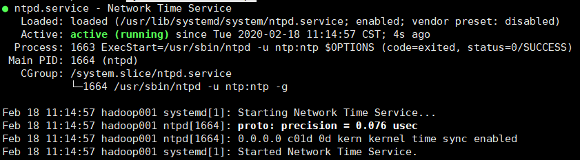
   - 验证是否成功, 如果能看到本地的ntpd则表示修改成功
        - `ntpq -p`
   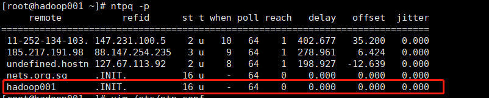
3. 其他从节点停⽌禁⽤ntpd服务 (仅Slave)
```
systemctl stop ntpd
systemctl disable ntpd
/usr/sbin/ntpdate hadoop001
```
4. 每天凌晨同步hadoop001节点时间 (仅Slave)
```
crontab -e
00 00 * * * /usr/sbin/ntpdate hadoop001
```
   
### 部署JDK(ALL)
1. 上传JDK安装包
2. 创建文件夹
`mkdir /usr/java`
3. 解压JDK
`tar -xvf jdk-8u45-linux-x64.gz -C /usr/java/`
4. 修正所属⽤户及⽤户组 `chown -R root:root /usr/java/jdk1.8.0_45`
5. 配置环境变量
    - `vim  /etc/profile`
    - 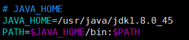
    - `source /etc/profile`
    - 验证 `which java`
    
### 安装MySQL5.7(仅Master)
1. 清理环境
    - 检查mysql `rpm -qa |grep -i mysql`
    - 检查mariadb `rpm -qa |grep -i mariadb`
    - 如果有, 则使用 `rpm -e 包名` 或 `yum -y autoremove 包名` 进行清除 
2. 解压 `tar -xvf mysql-5.7.29-1.el7.x86_64.rpm-bundle.tar`
3. 安装
```
rpm -ivh mysql-community-libs-5.7.29-1.el7.x86_64.rpm
rpm -ivh mysql-community-common-5.7.29-1.el7.x86_64.rpm
rpm -ivh mysql-community-client-5.7.29-1.el7.x86_64.rpm
rpm -ivh mysql-community-server-5.7.29-1.el7.x86_64.rpm
```
4. 启动mysqld `systemctl enable mysqld`
5. mysql设置为开机自启动 `systemctl enable mysqld`
6. 获取随机密码 `grep "password" /var/log/mysqld.log`
7. 设置新密码 `set password for root@localhost = password('密码');`
8. 刷新权限 `flush privileges;`
9. 设置root允许远程访问
```
use mysql;
update user set host = '%'  where user = 'root';
flush privileges;
```
10. 设置密码策略(选配)
```mysql
set global validate_password_length=1;
set global validate_password_policy=0;
flush privileges;
```

### 创建CDH的元数据库和⽤户、amon服务的数据库及⽤户(仅Master)
```mysql
create database cmf DEFAULT CHARACTER SET utf8;
create database amon DEFAULT CHARACTER SET utf8;
grant all on cmf.* TO 'cmf'@'%' IDENTIFIED BY 'cmfcmf';
grant all on amon.* TO 'amon'@'%' IDENTIFIED BY 'amonamon';
flush privileges;
```

### 部署mysql jdbc jar(仅Master)
```shell script
mkdir -p /usr/share/java/
cp mysql-connector-java.jar /usr/share/java/  # 注: jar包不能包含版本号
```

### CDH部署
1. 离线部署cm server及agent(ALL)
    - 创建⽬录及解压
    ```shell script
    mkdir /opt/cloudera-manager
    tar -zxvf cloudera-manager-centos7-cm5.16.1_x86_64.tar.gz -C /opt/cloudera-manager/
    ```
    - 所有节点修改agent的配置，指向server的节点hadoop001
    `sed -i "s/server_host=localhost/server_host=hadoop001/g" /opt/cloudera-manager/cm-5.16.1/etc/cloudera-scm-agent/config.ini`
    - 主节点修改server的配置(仅Master):
    ```shell script
    vim /opt/cloudera-manager/cm-5.16.1/etc/cloudera-scm-server/db.properties
    com.cloudera.cmf.db.type=mysql
    com.cloudera.cmf.db.host=hadoop001
    com.cloudera.cmf.db.name=cmf
    com.cloudera.cmf.db.user=cmf
    com.cloudera.cmf.db.password=cmfcmf
    com.cloudera.cmf.db.setupType=EXTERNAL
    ```
    - 所有节点创建⽤户 
    `useradd --system --home=/opt/cloudera-manager/cm-5.16.1/run/cloudera-scm-server/ --no-create-home --shell=/bin/false --comment "Cloudera SCM User" cloudera-scm`
    - ⽬录修改⽤户及⽤户组
    `chown -R cloudera-scm:cloudera-scm /opt/cloudera-manager`
2. 部署离线parcel源(仅Master)
    - `mkdir -p /opt/cloudera/parcel-repo`
    - 上传以下文件
        - 注意.sha1要修改为.sha和mysql-connector-java.jar不能带版本号
        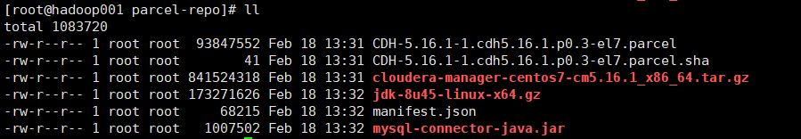
    - ⽬录修改⽤户及⽤户组
    `chown -R cloudera-scm:cloudera-scm /opt/cloudera/`
3. 所有节点创建软件安装⽬录、⽤户及⽤户组权限
    ```shell script
    mkdir -p /opt/cloudera/parcels
    chown -R cloudera-scm:cloudera-scm /opt/cloudera/
    ```
4. 启动Server(仅Master)
    ```shell script
    /opt/cloudera-manager/cm-5.16.1/etc/init.d/cloudera-scm-server start
    ```
5. 启动agent(ALL)
    ```shell script
    /opt/cloudera-manager/cm-5.16.1/etc/init.d/cloudera-scm-agent start
    ```
   - 注： 启动agent如果报, 则执行`yum install psmisc -y`

### CDH组件安装
1. 登陆IP:7180, 用户名密码默认均为admin
    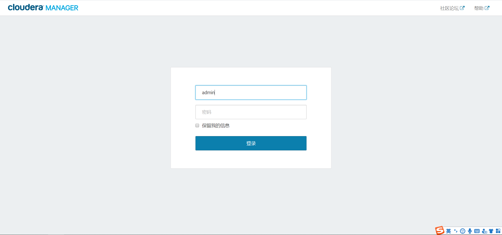
2. 选择是, 点击继续
    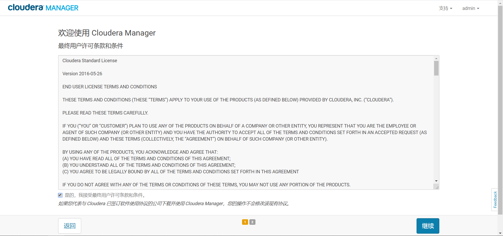
3. 选择免费, 点击继续
    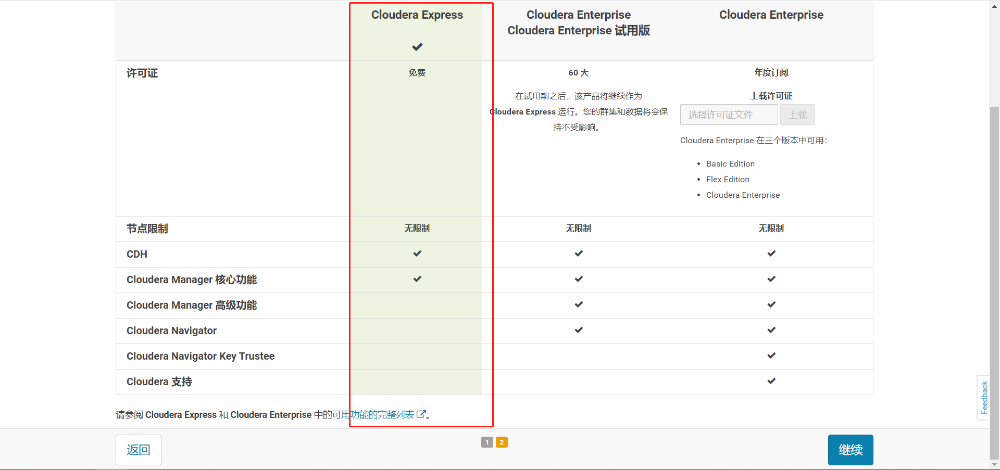
4. 选择继续
    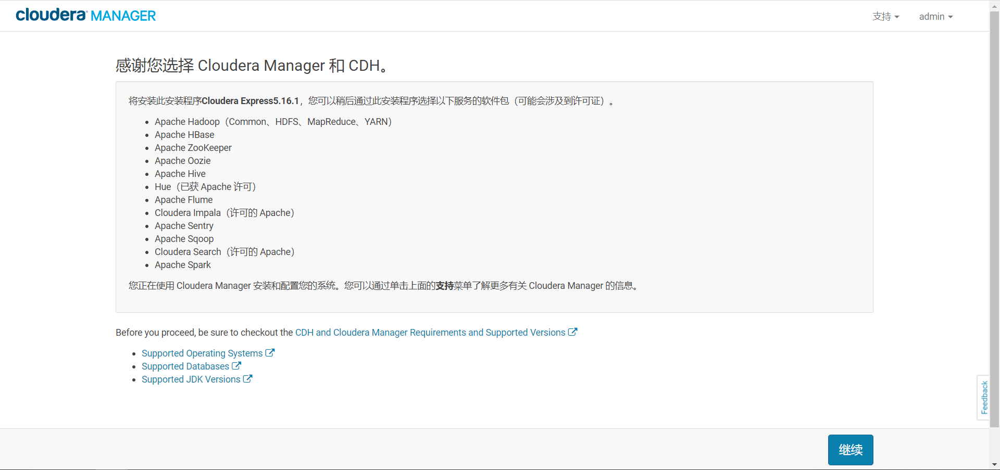
5. 选择当前管理的主机, 并勾选所有主机， 点击继续
    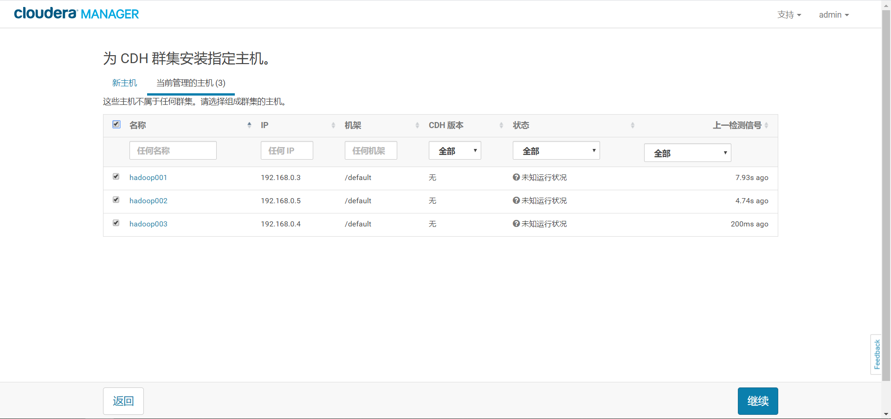
6. 默认配置，点击继续
    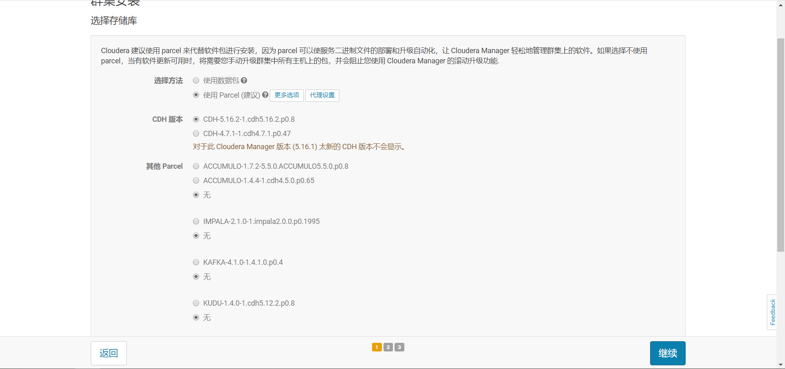
7. 