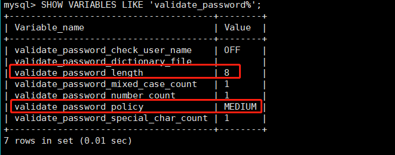

### ERROR 1819 (HY000): Your password does not satisfy the current policy requirements
1. 查看 mysql 初始的密码策略
    - `SHOW VARIABLES LIKE 'validate_password%';`
    
        - validate_password_length: 密码最低长度
        - validate_password_policy: 密码策略登录
2. 修正
    - 执行以下语句
        ```mysql
        set global validate_password_policy=LOW;
        set global validate_password_length=4;
        ```
    - 或修改配置文件
        - 编辑my.cnf文件
        - 添加 validate_password=OFF
        - 保存并重启mysql即可